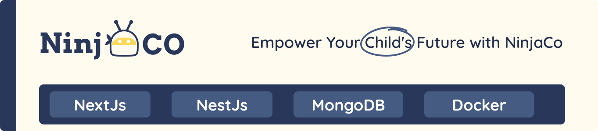

<div align="center">

> The project is a web application that allows kids to learn and practice programming using visual blocks with a user-friendly editor

**[PROJECT PHILOSOPHY](#project-philosophy) • [USER STORIES](#user-stories) • [WIREFRAMES](#wireframes) • [DESIGN](#design) • [TECH STACK](#tech-stack) • [HOW TO RUN](#how-to-run)**

</div>

<a id="project-philosophy"></a>
<br><br>
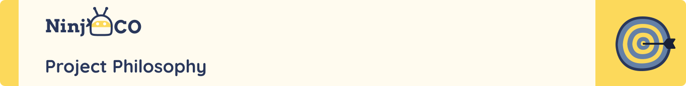

> Programming is a skill that is becoming more and more important in our society. However, it is not easy to learn and practice programming. This project aims to make programming more accessible to kids by providing a visual block-based editor that allows them to learn and practice programming in a fun and engaging way.
>
> The project main goal is to empower young kids with programming knowledge and skills. The project is designed to be fun, engaging, and easy to use. The project is also designed to be a tool for teachers to help them teach programming to kids.

<a id="user-stories"></a>
<br><br>

| User Story | Description |
| --- | --- |
| Navigate landing page | The user should be able to navigate a landing page with comprehensive info on the company.|
| Register as user | The user shall be able to register into the system. |
| Login as user | The user shall be able to log in to the system. |
| Validate and verify email addresses | The system should validate and verify email addresses. |
| Recovering the password | The user should be able to recover their password once forgotten by sending a recovery request. |
| View profile | The user shall be able to view their profile |
| Edit profile | The user should be able to edit their profile information. |
| View leaderboard | The system shall have a leaderboard to rank users based on their performance. |
|  See all courses | The user shall be able to see all the courses available. |
|  Open a course | The user shall be able to open a course. |
| Enroll in a course | The user shall be able to enroll in a course. |
| Browse missions | The user shall be able to browse missions. |
| Filter missions | The user shall be able to filter missions. |
| Start a mission | The user shall be able to start a mission. |
| View mission details | The user shall be able to view mission details. |
| View building parts | The user shall be able to view building parts. |
| View step by step instructions | The user shall be able to view step by step instructions. |
| Code visually | The user shall be able to code visually. |
| View code | The user shall be able to view code. |
| Run code | The user shall be able to run code. |
| Download code | The user shall be able to download code. |
| Download agent | The user shall be able to download agent. |
| Run game code | The user shall be able to run game code. |
| Preview HTML | The user shall be able to preview HTML. |
| See confirmation message | The user shall be able to see a confirmation message after completing a mission. |
| See error message | The user shall be able to see an error message if an error occurs. |
| Preserving progress | The system shall preserve the user's progress. |
| Increase level | The system shall increase the user's level after completing a mission. |
| Provide feedback | The system shall provide feedback to the user. |
| Maintaing points | The system shall maintain the user's points. |
| Completing a level | The user shall be able to complete a level. |
| Completing a mission | The user shall be able to complete a mission. |
| Completing a course | The user shall be able to complete a course. |
| Present certificate | The system shall present a certificate to the user after completing a course. |
| View testimonials | The user shall be able to view testimonials. |

| Creator Story | Description |
| --- | --- |
| Login as creator | The creator shall be able to log in to the system. |
| View courses | The creator shall be able to view courses. |
| Add course | The creator shall be able to add a course. |
| Edit course | The creator shall be able to edit a course. |
| View missions | The creator shall be able to view missions. |
| Add mission | The creator shall be able to add a mission. |
| Edit mission | The creator shall be able to edit a mission. |
| View levels | The creator shall be able to view levels. |
| Add level | The creator shall be able to add a level. |
| Edit level | The creator shall be able to edit a level. |
| Create html level | The creator shall be able to create an html level. |
| Create game level | The creator shall be able to create a game level. |
| Assign categories | The creator shall be able to assign categories to a mission. |

| Admin Story | Description |
| --- | --- |
| Login as admin | The admin shall be able to log in to the system. |
| View dashboard | The admin shall be able to view the dashboard. |
| View users | The admin shall be able to view users. |
| View courses | The admin shall be able to view courses. |
| View creators | The admin shall be able to view creators. |
| Add user | The admin shall be able to add a user. |
| Edit user | The admin shall be able to edit a user. |
| Delete user | The admin shall be able to delete a user. |
| Notify user | The admin shall be able to notify a user. |
| Add creator | The admin shall be able to add a creator. |
| Edit creator | The admin shall be able to edit a creator. |
| Delete creator | The admin shall be able to delete a creator. |
| Monitor users | The admin shall be able to monitor users. |

<a id="wireframes"></a>
<br><br>
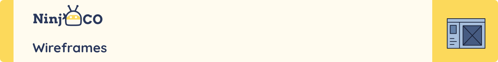

> This design was planned before on paper, then moved to Figma app for the fine details.
>
> We created our own Design System in figma to make the design process easier and faster.

| Design System |
| :---: |
| Colors |
| 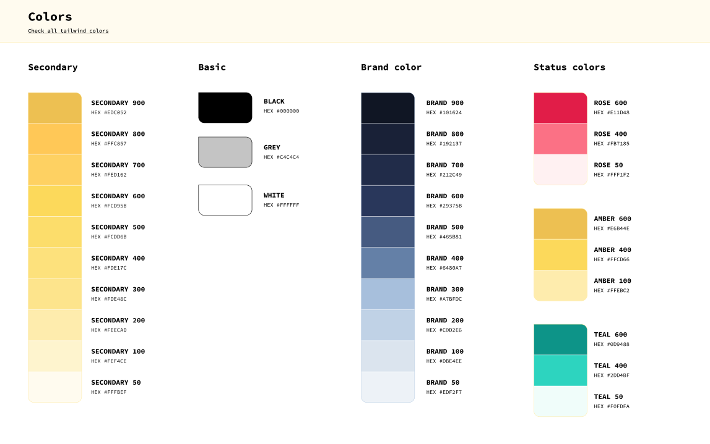 |
| Typography |
| 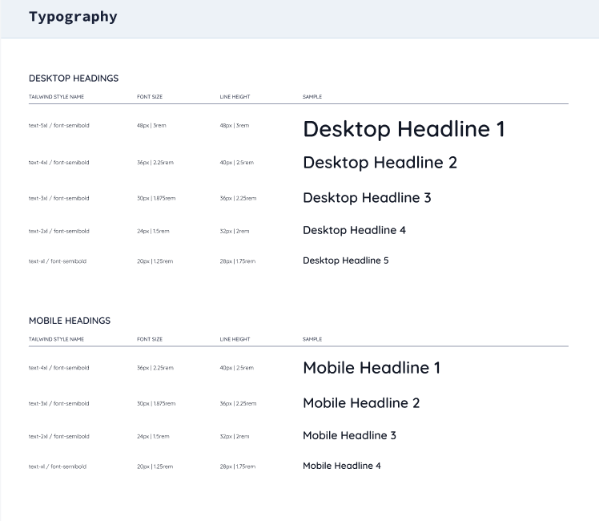 |
| Spacing |
| 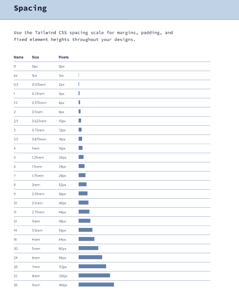 |

| Landing Page Wireframe|
| :---: |
| 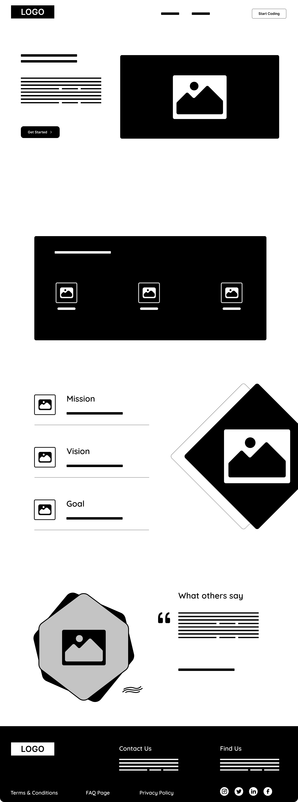 |

<a id="design"></a>
<br><br>
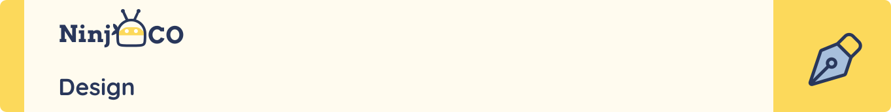

| Admin |
| :---: |
| Admin Dashboard |
| 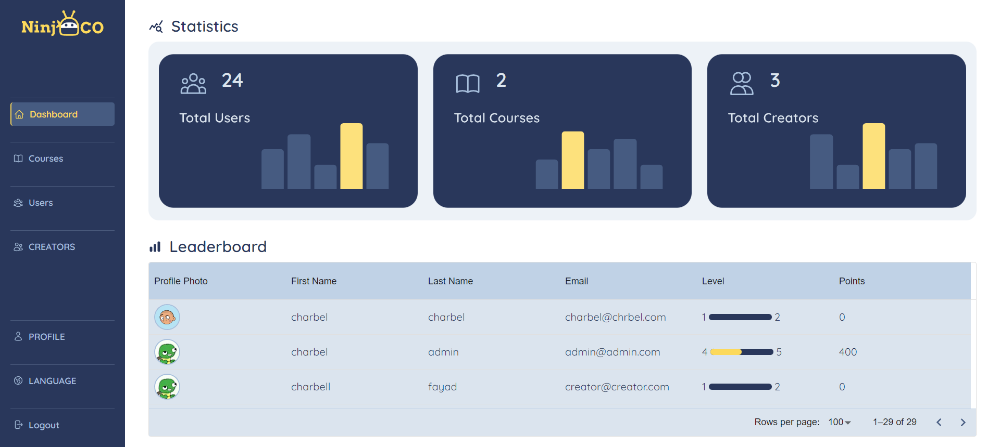 |
| Admin Users |
| 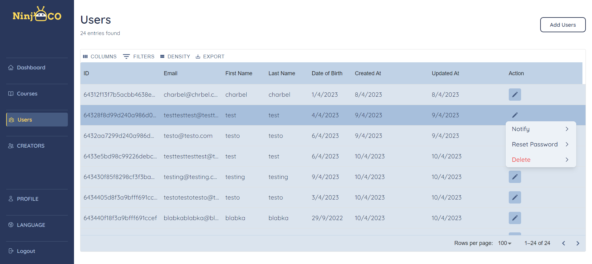 |
| Admin Courses |
| 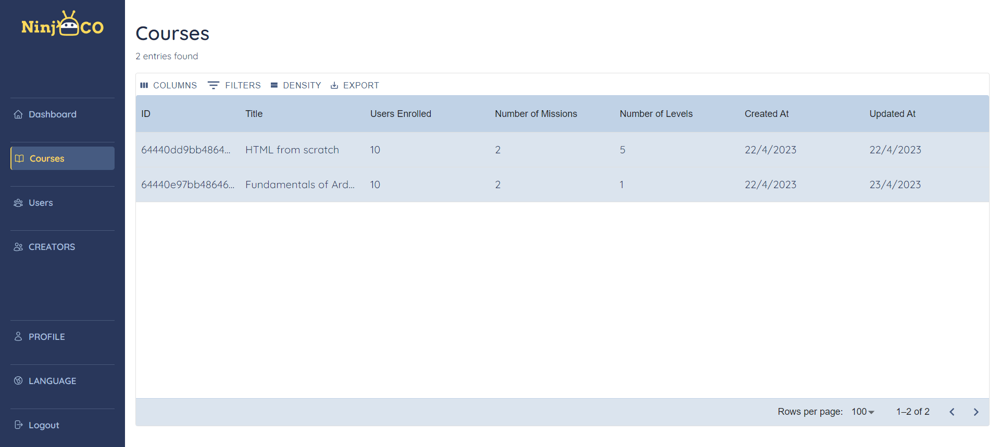 |

| Creator |
| :---: |
| Creator Dashboard |
| 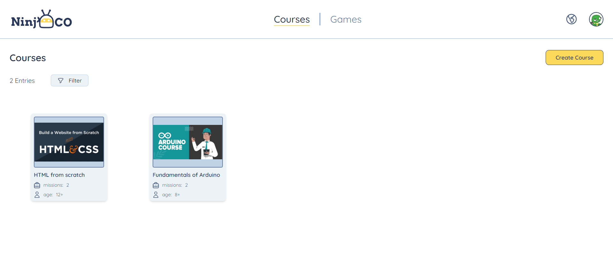 |
| Creator Create Course |
| 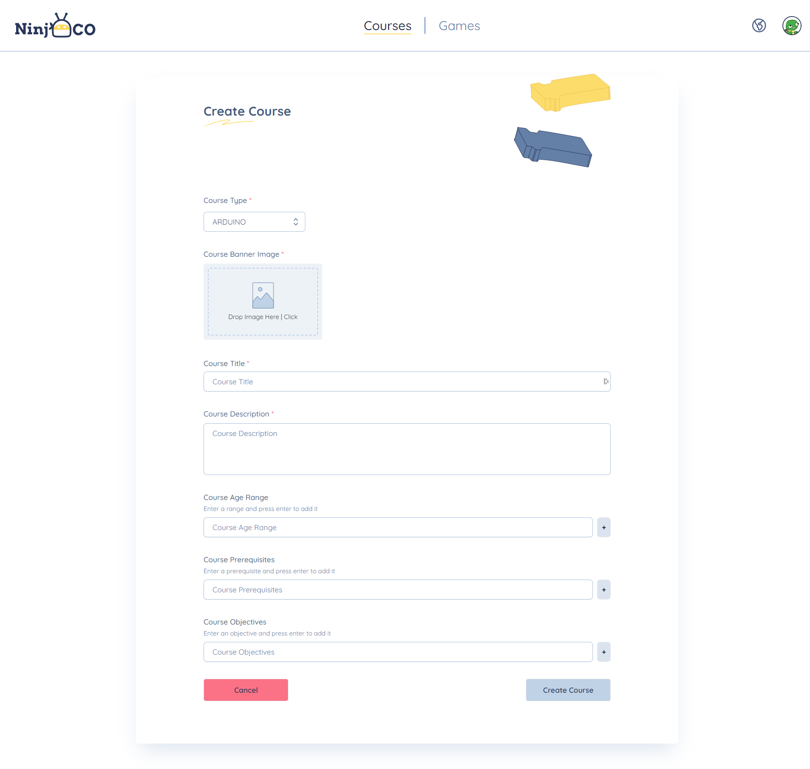 |
| Creator Create Game |
| 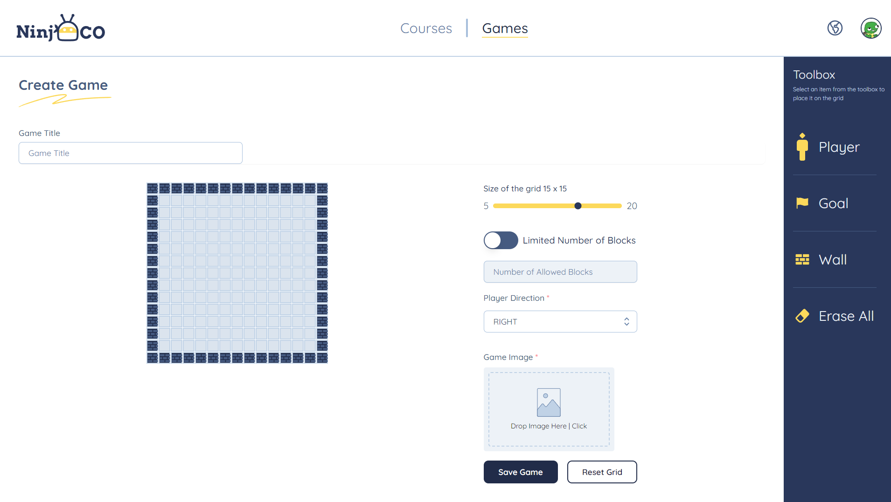 |

| User |
| :---: |
| User Game |
| 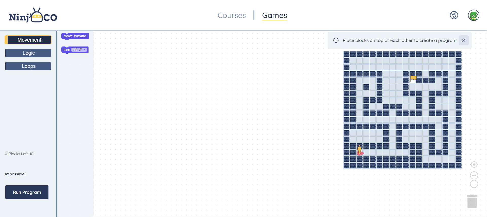 |
| User HTML |
| 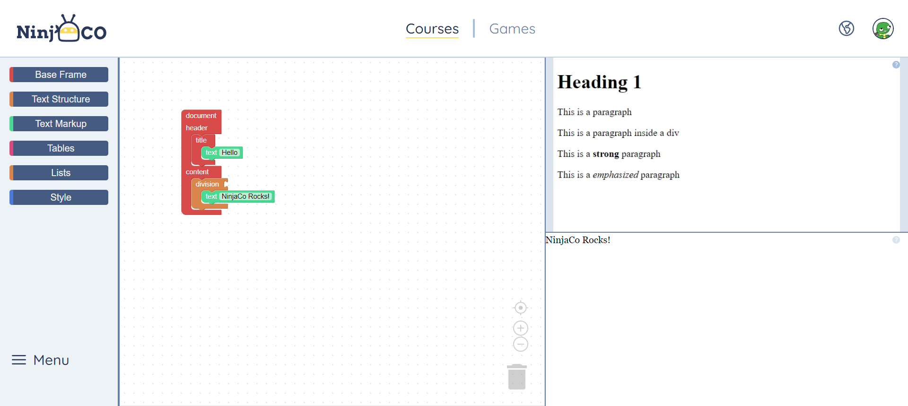 |
| User Arduino |
| 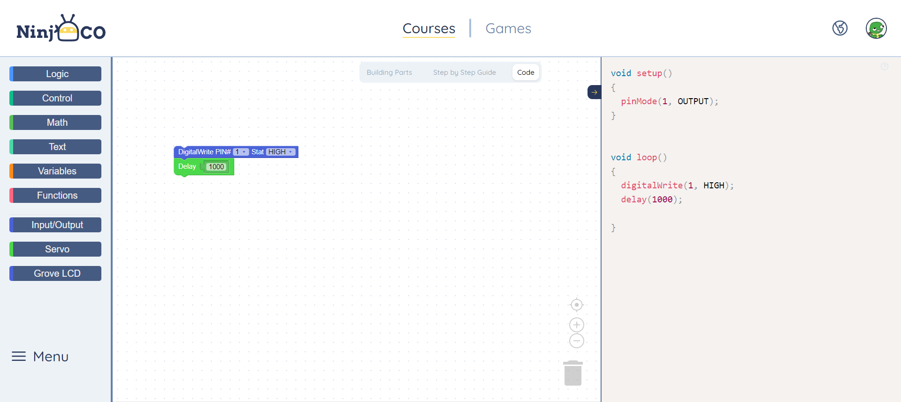 |
| User Profile |
| 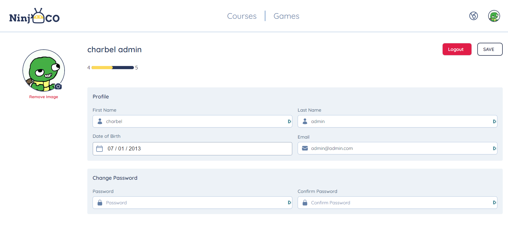 |

<a id="tech-stack"></a>
<br><br>
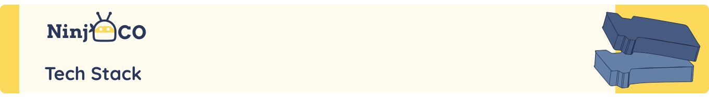

Here's a brief high-level overview of the tech stack the NinjaCo app uses:

- This project uses the [NextJs](https://nextjs.org/) library. Nextjs is a React framework that allows you to build server-side rendered React apps. It is a framework that allows you to build React apps with a lot of features out of the box, such as routing, server-side rendering, and more.
- For styling, the app uses [Tailwind CSS](https://tailwindcss.com/), a utility-first CSS framework for rapidly building custom user interfaces.
- For authentication, the app uses [NextAuth](https://next-auth.js.org/), an open source authentication library for Next.js.

- For testing, the app uses [Jest](https://jestjs.io/), a JavaScript testing framework. Jest is a complete and easy to set-up JavaScript testing solution. It works with projects using: Babel, TypeScript, Node, React, Angular, Vue and more!

- For linting, the app uses [ESLint](https://eslint.org/), a pluggable and configurable linter tool for identifying and reporting on patterns in JavaScript. ESLint is built into most text editors and you can run ESLint as part of your continuous integration pipeline.

- For persistent storage, the app uses [MongoDB](https://www.mongodb.com/), a general purpose, document-based, distributed database built for modern application developers and for the cloud era.

- For backend API, the app uses [NestJS](https://nestjs.com/), a progressive Node.js framework for building efficient, reliable and scalable server-side applications.

- For image storage, the app uses [Minio](https://min.io/), an open source object storage server compatible with Amazon S3 APIs. Minio is a high performance distributed object storage server, designed for large-scale private cloud infrastructure.

- For code formatting, the app uses [Prettier](https://prettier.io/), an opinionated code formatter. Prettier is an opinionated code formatter with support for JavaScript, TypeScript, CSS, JSON, GraphQL, Markdown, and more. It removes all original styling and ensures that all outputted code conforms to a consistent style.

<br><br>

<div style="display:grid; grid-template-columns: repeat(3, 0.4fr); justify-items: center; align-items: center;">


</div>

<br />
<hr>

<a id="how-to-run"></a>
<br><br>


> To get a local copy up and running follow these simple example steps.

### Prerequisites 📝

- [Node.js](https://nodejs.org/en/)
- [Docker](https://www.docker.com/)

<!-- add icons to  below text -->
### Setup 🚀

1. Clone the repository 🎉

```bash
git clone https://github.com/NinnjaCo/ninjaco-nextjs.git
```

2. Install dependencies ✨

```bash
npm install
```

3. Copy the `.env.example` file and rename it to `.env`

```bash
cp .env.example .env
```

> Edit the `.env` file and add your own values.

4. Run the server

- 4.1 Development mode 🐛

```bash
npm run dev
```

- 4.2 Production mode ⚡️

```bash
npm run build
npm run start
```
