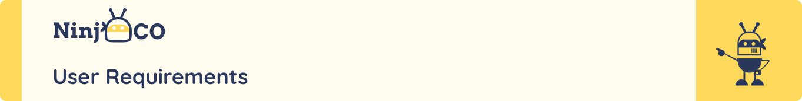
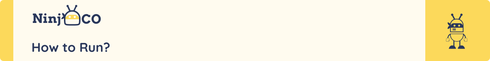

<div align="center">

> The project is a web application that allows kids to learn and practice programming using visual blocks with a user-friendly editor

**[PROJECT PHILOSOPHY](#project-philosophy) • [USER STORIES](#user-stories) • [WIREFRAMES](#wireframes) • [DESIGN](#design) • [TECH STACK](#tech-stack) • [HOW TO RUN](#how-to-run)**

</div>

<a id="project-philosophy"></a>
<br><br>


> Programming is a skill that is becoming more and more important in our society. However, it is not easy to learn and practice programming. This project aims to make programming more accessible to kids by providing a visual block-based editor that allows them to learn and practice programming in a fun and engaging way.
>
> The project main goal is to empower young kids with programming knowledge and skills. The project is designed to be fun, engaging, and easy to use. The project is also designed to be a tool for teachers to help them teach programming to kids.

<a id="user-stories"></a>
<br><br>

TODO

<a id="wireframes"></a>
<br><br>


> This design was planned before on paper, then moved to Figma app for the fine details.
>
> We created our own Design System in figma to make the design process easier and faster.

TODO

<a id="design"></a>
<br><br>

TODO

<a id="tech-stack"></a>
<br><br>


Here's a brief high-level overview of the tech stack the NinjaCo app uses:

- This project uses the [NextJs](https://nextjs.org/) library. Nextjs is a React framework that allows you to build server-side rendered React apps. It is a framework that allows you to build React apps with a lot of features out of the box, such as routing, server-side rendering, and more.
- For styling, the app uses [Tailwind CSS](https://tailwindcss.com/), a utility-first CSS framework for rapidly building custom user interfaces.
- For authentication, the app uses [NextAuth](https://next-auth.js.org/), an open source authentication library for Next.js.

- For testing, the app uses [Jest](https://jestjs.io/), a JavaScript testing framework. Jest is a complete and easy to set-up JavaScript testing solution. It works with projects using: Babel, TypeScript, Node, React, Angular, Vue and more!

- For linting, the app uses [ESLint](https://eslint.org/), a pluggable and configurable linter tool for identifying and reporting on patterns in JavaScript. ESLint is built into most text editors and you can run ESLint as part of your continuous integration pipeline.

- For persistent storage, the app uses [MongoDB](https://www.mongodb.com/), a general purpose, document-based, distributed database built for modern application developers and for the cloud era.

- For backend API, the app uses [NestJS](https://nestjs.com/), a progressive Node.js framework for building efficient, reliable and scalable server-side applications.

- For code formatting, the app uses [Prettier](https://prettier.io/), an opinionated code formatter. Prettier is an opinionated code formatter with support for JavaScript, TypeScript, CSS, JSON, GraphQL, Markdown, and more. It removes all original styling and ensures that all outputted code conforms to a consistent style.

<br><br>

<div style="display:grid; grid-template-columns: repeat(3, 0.4fr); justify-items: center; align-items: center;">


</div>

<br />
<hr>

<a id="how-to-run"></a>
<br><br>


> To get a local copy up and running follow these simple example steps.

### Prerequisites 📝

- [Node.js](https://nodejs.org/en/)
- [Docker](https://www.docker.com/)

<!-- add icons to  below text -->
### Setup 🚀

1. Clone the repository 🎉

```bash
git clone https://github.com/NinnjaCo/ninjaco-nextjs.git
```

2. Install dependencies ✨

```bash
npm install
```

3. Run the server

- 3.1 Development mode 🐛

```bash
npm run dev
```

- 3.2 Production mode ⚡️

```bash
npm run build
npm run start
```
